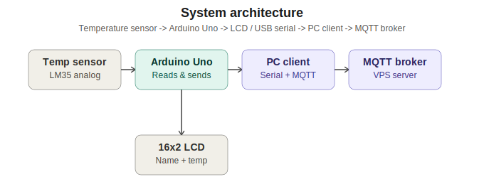

# Temperature monitoring system: sensor -> Arduino -> LCD -> PC -> MQTT
Names:GANWA Anne Laure
Link to dashboard: http://157.173.101.159:8214/
## System architecture



The temperature sensor (LM35) produces an analog voltage proportional to temperature,
which the Arduino Uno samples on pin A0. The Arduino does two things with each reading:
it writes the candidate's name and the temperature to the 16x2 LCD, and it sends the same
reading as a text line over the USB serial connection. On the PC side, a Python client
reads those serial lines, prints them to the console in real time, and republishes each
one to an MQTT broker hosted on a VPS, where any subscriber on the network can receive the
live feed.

## Files
- `arduino/temperature_lcd_serial.ino` - Arduino sketch: reads the sensor, drives the LCD
  (with horizontal scrolling for long names), sends each reading over serial.
- `pc_client/serial_to_mqtt.py` - Python client: reads serial, publishes to MQTT, prints
  readings live to the console.
- `pc_client/requirements.txt` - pip dependencies for the PC client.

## Hardware wiring
| LM35 pin | Arduino Uno |
|----------|-------------|
| VCC      | 5V          |
| GND      | GND         |
| OUT      | A0          |

| LCD pin (I2C backpack) | Arduino Uno |
|--------------------------|-------------|
| GND                       | GND         |
| VCC                       | 5V          |
| SDA                       | A4          |
| SCL                       | A5          |

No contrast potentiometer or backlight resistor needed — the I2C backpack board handles
both (most have a small trim pot on the backpack itself for contrast). You'll also need to
install the **LiquidCrystal I2C** library (by Frank de Brabander) via the Arduino IDE's
Library Manager — it isn't built in like the parallel `LiquidCrystal` library is.

The backpack's I2C address is usually `0x27` or `0x3F`, set in the sketch via
`LCD_I2C_ADDRESS`. If the screen stays blank after uploading, run an I2C scanner sketch
(search "Arduino I2C scanner") to find the correct address.

## Communication names used

**Serial link (Arduino <-> PC)**
- Interface: USB CDC virtual serial port
- Baud rate: `9600`
- Protocol: one ASCII line per reading, format `TEMP:<value>\n`, e.g. `TEMP:23.45`
- On the PC this typically appears as `COM3` (Windows) or `/dev/ttyACM0` / `/dev/ttyUSB0` (Linux/macOS)

**MQTT (PC <-> broker)**
- Broker: your VPS, e.g. `mqtt.example.com` or its IP, port `1883` (or `8883` for TLS)
- Topic: `exam/<CANDIDATE_NAME>/temperature` (e.g. `exam/JohnDoe/temperature`) - the
  candidate name keeps each station's data on its own topic so multiple rigs can publish
  to the same broker without colliding. Edit `CANDIDATE_NAME` in `serial_to_mqtt.py` to match.
- Payload: plain text temperature value, e.g. `23.45`
- QoS: 0 (acceptable for a periodic, non-critical sensor feed)

## Running it
1. Open `arduino/temperature_lcd_serial.ino` in the Arduino IDE, set `CANDIDATE_NAME` at the
   top to the candidate's actual name, select board "Arduino Uno" and the correct port, then
   upload.
2. On the PC, install dependencies:
   ```
   pip install -r pc_client/requirements.txt
   ```
3. Edit the configuration block at the top of `pc_client/serial_to_mqtt.py`:
   `SERIAL_PORT`, `CANDIDATE_NAME`, `MQTT_BROKER_HOST`, `MQTT_BROKER_PORT`, and credentials
   if the broker requires authentication.
4. Run the client:
   ```
   python pc_client/serial_to_mqtt.py
   ```
   It prints each incoming reading with a timestamp and whether the MQTT publish succeeded.
5. To verify on the broker side, subscribe from another terminal with a tool like
   `mosquitto_sub -h <broker> -t "exam/+/temperature"`.

## Notes on the LCD scrolling behaviour
- If `CANDIDATE_NAME` is 16 characters or fewer, it is printed once on row 1 and stays static.
- If it's longer than 16 characters, the sketch builds a circular buffer of the name plus a
  3-character gap, and shifts the visible 16-character window left every 400 ms (non-blocking,
  using `millis()`), producing a continuous left-scrolling marquee. Row 2 is never touched by
  the scroll logic, so the temperature reading stays stable while the name scrolls.
Dashboard URL (local execution):
http://127.0.0.1:5000